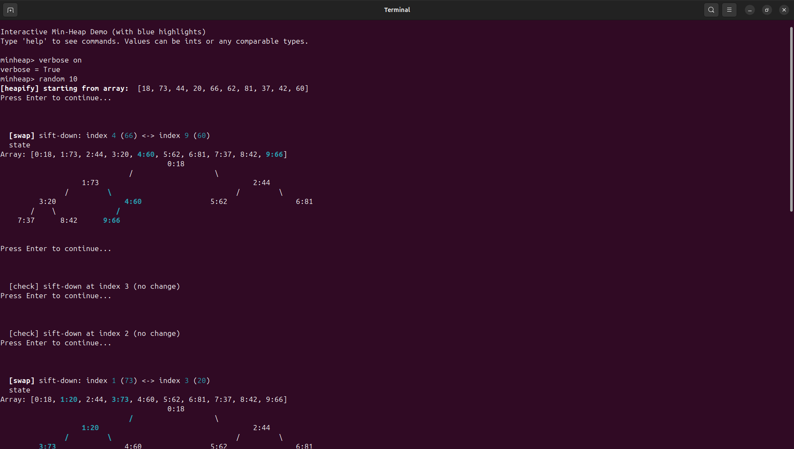

# heap-demo

<p align="right">
  <a href="README.md">English</a> |
  <strong>Português (Brasil)</strong>
</p>

Uma demonstração interativa em Python de **estruturas de dados do tipo min-heap**.  
Inclui **visualizações do array e da árvore em ASCII**, operações de `heapify`, `insert`, `delete` e `extract-min`, com **rastreamento passo a passo opcional** para ilustrar como o **invariante do heap** é mantido.

---

## 📌 Visão Geral

> **Demonstração Interativa de Min-Heap (CLI)**  
> Projetada para ensino e aprendizagem de **heaps e filas de prioridade** em disciplinas de graduação em algoritmos e estruturas de dados.

Esta ferramenta permite que estudantes **visualizem** como um min-heap evolui internamente:
- como a representação em array é mapeada para uma árvore,
- como os elementos se movem durante `sift-up` e `sift-down`,
- e por que a propriedade do heap é preservada após cada operação.

---

## 🖼️ Visão Geral da Ferramenta (Visualização)



---

## 🎯 Objetivo Principal

O principal objetivo do **heap-demo** é **pedagógico**:

- Tornar algoritmos de heap **transparentes e observáveis**
- Conectar a **implementação baseada em array** com a **intuição da árvore**
- Apoiar **demonstrações passo a passo em sala de aula**
- Ajudar estudantes a compreender:
  - o **invariante do min-heap**
  - as relações de índice pai/filho
  - por que o `heapify` funciona de baixo para cima
  - como inserções e remoções preservam a corretude

---

## 🧠 O Que Esta Ferramenta Ensina

- Invariante do min-heap: todo nó é ≤ seus filhos
- Representação de heaps em array (indexação baseada em 0)
- Relações de índice:
  - `parent(i) = (i - 1) // 2`
  - `left(i) = 2i + 1`
  - `right(i) = 2i + 2`
- Operações fundamentais:
  - `heapify` (construção bottom-up)
  - inserção (`insert` / `push`)
  - remoção do mínimo (`extract-min` / `pop`)
  - remoção em um índice arbitrário
- Diferença entre a **visualização lógica em árvore** e o **armazenamento físico em array**

---

## ⚙️ Visão Geral da Implementação

- **Linguagem:** Python 3
- **Interface:** REPL interativo (linha de comando)
- **Dependências:** Nenhuma obrigatória  
  - Se `colorama` estiver instalado, ele é usado automaticamente no Windows para saída colorida
- **Visualização:**
  - Visualização do array no formato `índice:valor`
  - Árvore em ASCII renderizada por níveis
  - Destaque opcional em azul para nós e trocas
- **Rastreamento:**
  - Execução passo a passo com pausas (`verbose on`)
  - Mensagens explícitas explicando trocas, verificações e condições de parada

---

## ▶️ Como Executar

Clone o repositório e execute o script:

```bash
git clone https://github.com/BrunoGrisci/heap-demo.git
cd heap-demo
python3 heap_demo.py

```

O programa inicia um shell interativo:
```
Interactive Min-Heap Demo (with blue highlights)
Type 'help' to see commands. Values can be ints or any comparable types.
minheap>
```
---

🕹️ Como Usar (Comandos do REPL)

Digite `help` dentro da ferramenta para ver todos os comandos disponíveis.

### Comandos Principais

```
viz | visualize             Imprime o heap como array e árvore ASCII
push X | insert X           Insere o valor X
pop | extractmin            Remove e imprime o elemento mínimo
delete i | del i            Remove o elemento no índice i do array
peek | findmin              Imprime o mínimo atual
len                         Imprime o número de elementos
clear                       Esvazia o heap
array                       Mostra apenas o array subjacente

```

### Carregamento e Construção de Heaps

```
load [a,b,c,...]            Substitui o heap pela lista e aplica heapify
heapify                     Reaplica heapify ao array atual
random N [lo hi]            Carrega N inteiros aleatórios (intervalo opcional)

```

### Rastreamento e Interação

```
verbose on|off              Ativa/desativa rastreamento passo a passo
quit | exit                 Encerra o programa

```
---

## 🔍 Exemplo de Sessão

```
minheap> load [7,3,10,9,4,12,8,15,20,5]
minheap> viz
minheap> verbose on
minheap> push 2
minheap> pop

```

Quando o modo `verbose` está ativado, a ferramenta:

- destaca os índices envolvidos em cada operação,
- imprime o motivo de cada troca ou verificação,
- mprime o motivo de cada troca ou verificação.

---

## ⚠️ Observações para Estudantes

- O comando `delete i` remove um elemento pelo **índice do array**, não pelo valor.
- Todos os valores armazenados no heap devem ser mutuamente comparáveis.
- Esta é uma implementação de min-heap (não max-heap).
- TO objetivo principal é compreensão, não eficiência ou uso em larga escala.

---

 🧑‍🏫 Usos Sugeridos em Sala de Aula

- Demonstrações ao vivo durante aulas
- Sessões de laboratório guiadas
- Comparação entre `heapify` e inserções repetidas
- Visualização de `sift-up` e `sift-down`
- Apoio a discussões sobre corretude e invariantes
- Exercícios de depuração (“Por que o algoritmo para aqui?”)

---

## 📖 Referências

- T. H. Cormen et al., Introduction to Algorithms, MIT Press
- J. Kleinberg & É. Tardos, Algorithm Design

---

## 👨‍🏫 Créditos

**Autor:**
Prof. Bruno Iochins Grisci
https://brunogrisci.github.io/

**Disciplina:**
Projeto e Análise de Algoritmos I

**Instituição:**
Universidade Federal do Rio Grande do Sul (UFRGS)
Instituto de Informática
Departamento de Informática Teórica

**Contribuidores:**
Bruno Iochins Grisci
Rodrigo Machado

---

## 📄 Licença

Este projeto está licenciado sob a Licença MIT.
Veja o arquivo `LICENSE` para mais detalhes.

